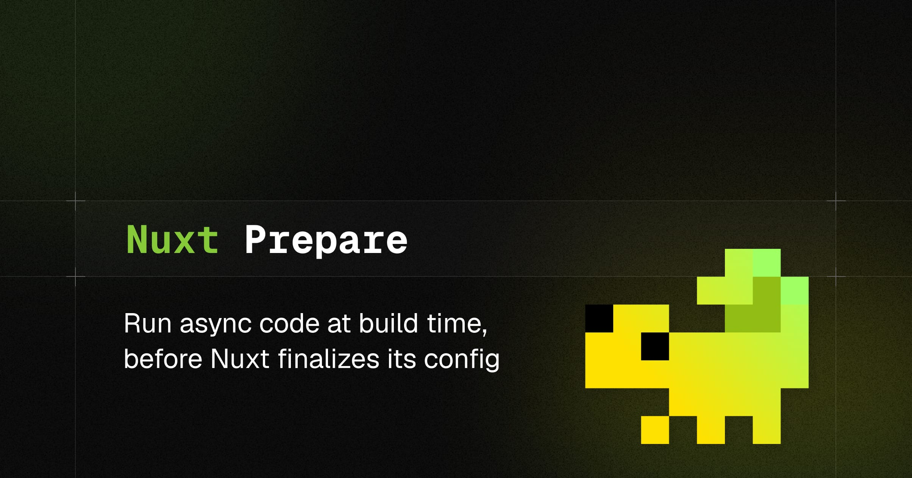

[](https://nuxt-prepare.byjohann.dev)

# Nuxt Prepare

Run async code at build time, before [Nuxt](https://nuxt.com) finalizes its config.

- [✨ &nbsp;Release Notes](https://github.com/johannschopplich/nuxt-prepare/releases)
- [📖 &nbsp;Read the documentation](https://nuxt-prepare.byjohann.dev)

## Features

- 🦦 Zero configuration
- 🦎 Run sync or async operations when Nuxt builds your app
- ✂️ Conditionally overwrite runtime config or app config values
- 🍡 Run scripts in series or parallel
- 🥢 Ready for [Nitro](https://nitro.build) server routes
- 🦾 Typed handlers with [`defineNuxtPrepareHandler`](https://nuxt-prepare.byjohann.dev/api/define-nuxt-prepare-handler)

## Setup

```bash
npx nuxt module add prepare
```

## Basic Usage

Add Nuxt Prepare to your Nuxt configuration:

```ts
// `nuxt.config.ts`
export default defineNuxtConfig({
  modules: ['nuxt-prepare']
})
```

By default, Nuxt Prepare will look for a `server.prepare.ts` file in your project root. To run synchronous or asynchronous code when Nuxt builds your app, define a handler in your project root and export a default function:

```ts
// `server.prepare.ts`
import { defineNuxtPrepareHandler } from 'nuxt-prepare/config'

export default defineNuxtPrepareHandler(async () => {
  // Fetch data from an API, read a file, query a database …

  return {
    // Overwrite the runtime config variable `foo`
    runtimeConfig: {
      public: {
        foo: 'Overwritten by "server.prepare" script'
      }
    },

    // Pass custom state to Nuxt and import it
    // anywhere from `#nuxt-prepare`
    state: {
      foo: 'bar'
    }
  }
})
```

> [!TIP]
> You can run as many prepare scripts as you want – add them to the `prepare.scripts` module configuration.

The [documentation](https://nuxt-prepare.byjohann.dev) covers the handler API, prepare state and every module option.

## 💻 Development

1. Clone this repository
2. Enable [Corepack](https://github.com/nodejs/corepack) using `corepack enable`
3. Install dependencies using `pnpm install`
4. Run `pnpm run dev:prepare`
5. Start development server using `pnpm run dev`

## Credits

- [Konkon](https://konkon.zip) for his logo pixel art.
- [McPizza0](https://github.com/McPizza0) for his inspirational [`nuxt-server-init`](https://github.com/McPizza0/nuxt-server-init) module.

## License

[MIT](./LICENSE) License © 2023-PRESENT [Johann Schopplich](https://github.com/johannschopplich)
