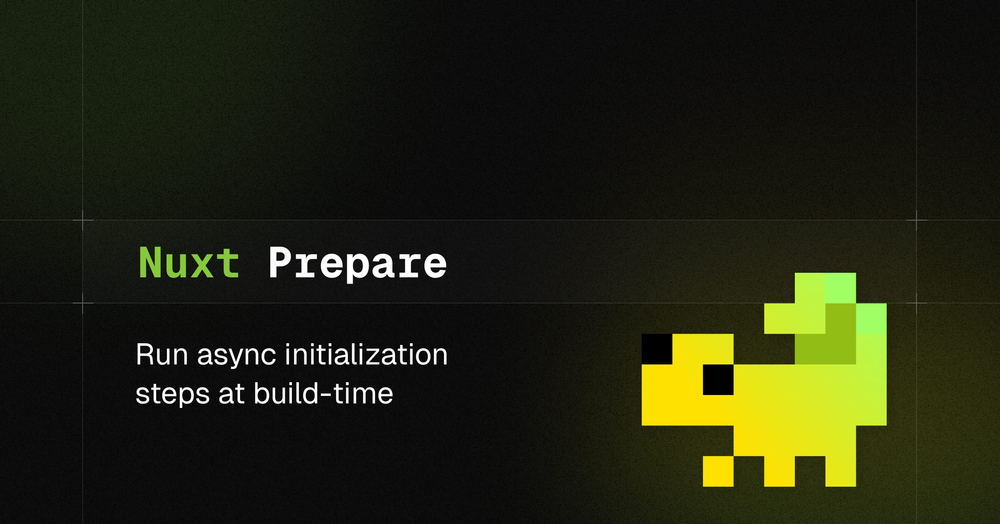

[](https://nuxt-prepare.byjohann.dev)

# nuxt-prepare

[](https://www.npmjs.com/package/nuxt-prepare)

[Nuxt](https://nuxt.com) module to run initialization steps at build time.

- [✨  Release Notes](https://github.com/johannschopplich/nuxt-prepare/releases)
- [📖  Read the documentation](https://nuxt-prepare.byjohann.dev)

## Features

- 🦦 Zero-Config
- 🦎 Run sync or async operations when Nuxt builds your app
- ✂️ Conditionally overwrite runtime config or app config variables
- 🦾 Better DX with [`defineNuxtPrepareHandler`](https://nuxt-prepare.byjohann.dev/api/define-nuxt-prepare-handler)

## Setup

> [!TIP]
> [📖 Read the documentation](https://nuxt-prepare.byjohann.dev)

```bash
# pnpm
pnpm add -D nuxt-prepare

# npm
npm i -D nuxt-prepare

# yarn
yarn add -D nuxt-prepare
```

## Basic Usage

> [!TIP]
> [📖 Read the documentation](https://nuxt-prepare.byjohann.dev)

Add the `nuxt-prepare` module to your `nuxt.config.ts`:

```ts
// `nuxt.config.ts`
export default defineNuxtConfig({
  modules: ['nuxt-prepare']
})
```

By default, `nuxt-prepare` will look for a `server.prepare.ts` file in your project root. To run synchronous or asynchronous code when Nuxt builds your app, define a handler in your project root and export a default function:

```ts
// `server.prepare.ts`
import { defineNuxtPrepareHandler } from 'nuxt-prepare/config'

export default defineNuxtPrepareHandler(async () => {
  // Do some async magic here, e.g. fetch data from an API

  return {
    // Overwrite the runtime config variable `foo`
    runtimeConfig: {
      public: {
        foo: 'overwritten by prepare script'
      }
    },

    // Pass custom state to Nuxt and import it
    // anywhere from `#nuxt-prepare`
    state: {
      foo: 'bar',
    },
  }
})
```

> [!NOTE]
> You can run as many prepare scripts as you want – add them to the `prepareKit.scripts` module configuration.

## 💻 Development

1. Clone this repository
2. Enable [Corepack](https://github.com/nodejs/corepack) using `corepack enable`
3. Install dependencies using `pnpm install`
4. Run `pnpm run dev:prepare`
5. Start development server using `pnpm run dev`

## Credits

- [Maronbeere](https://maronbeere.carrd.co) for his Chameleon pixel art.
- [McPizza0](https://github.com/McPizza0) for his inspirational [`nuxt-server-init`](https://github.com/McPizza0/nuxt-server-init) module.

## License

[MIT](./LICENSE) License © 2023-PRESENT [Johann Schopplich](https://github.com/johannschopplich)
